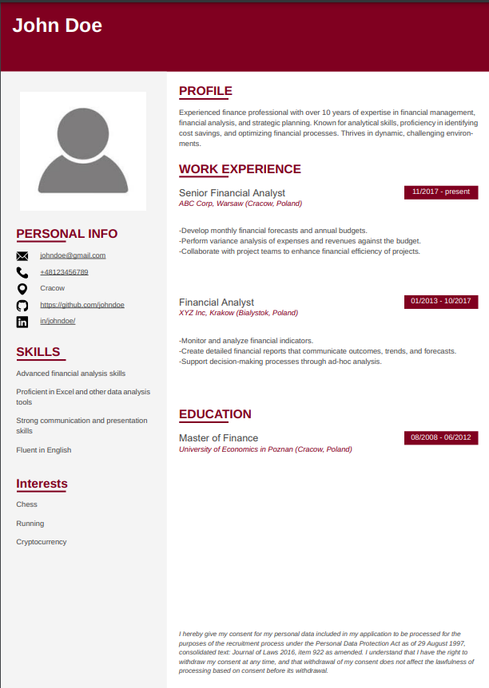

# React TypeScript Vite - Sample CV with @react-pdf/renderer

This project demonstrates how to create a dynamic and printable CV using React, TypeScript, and Vite. It utilizes `@react-pdf/renderer` to generate a PDF directly from React components, providing a straightforward approach to build and customize a CV.

## Features

- **React 18**: Utilizes the latest React framework for building user interfaces.
- **TypeScript**: Strongly typed programming language that builds on JavaScript, giving you better tooling at any scale.
- **Vite**: A fast and modern build tool that significantly improves the development experience.
- **@react-pdf/renderer**: Allows CV creation directly within React components, which can be exported as a PDF file.

## Installation

To get started with this project, follow these steps:

1. Clone the repository:
   ```bash
   git clone https://github.com/jakubr1712/react-pdf-viewer-Curriculum-vitae
   ```
2. Install dependencies:
   ```bash
   cd cv
   yarn
   ```
3. Run the development server:
   ```bash
   yarn dev
   ```

## Usage

After launching the application, navigate to `http://localhost:5173` to view the CV in your browser. You can modify the CV by editing the React components under the `src` folder.

## Example CV

Below is an example screenshot of the CV that you can generate with this project:



Feel free to customize the layout and content of the CV to suit your professional needs.

